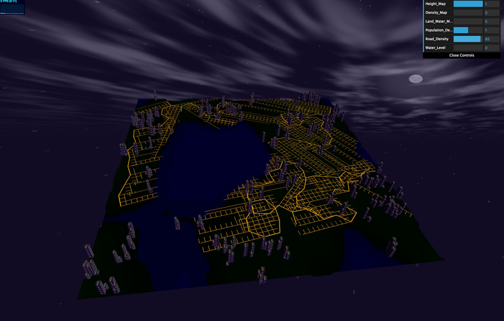
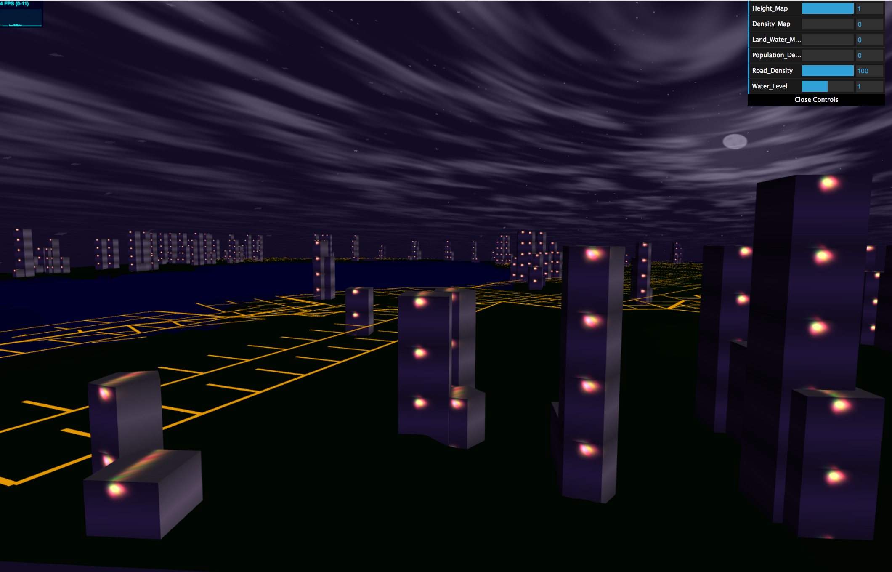
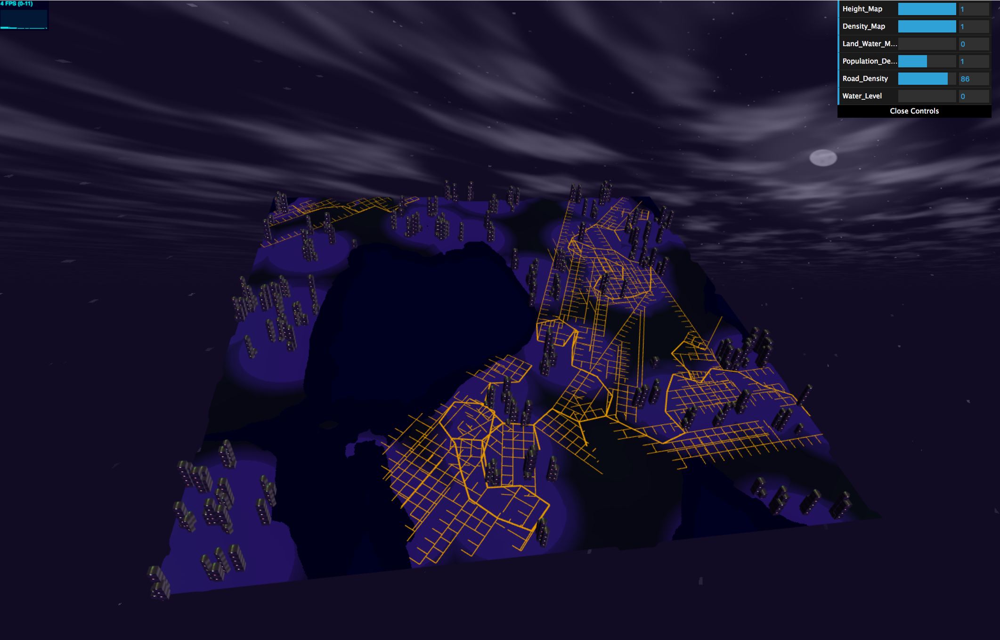
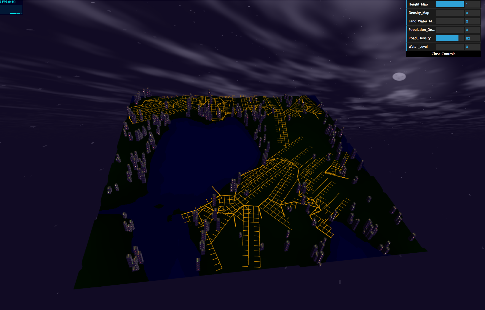

# hw06-city-generation

Evelyn Bailey

ebail

Project: https://eviebail.github.io/hw06-city-generation/

Website: https://evelyn.pb.studio

Features:

This project is an extension of https://github.com/eviebail/hw05-road-generation by transforming the 2D map into a 3D scene and adding procedurally generated and textured buildings.

Ground Plane: I took the original 2D map that generated the distribution of ground and water and mapped it to a subdivided plane whose vertices were multiplied with the inverse projection matrix to allow it to be rotated in 3D space. The vertex positions of any areas that are 'ground' are slightly raised above the water, and there is a slight slope between the two areas achieved by linearly interpolating between the y positions of ground and water in those transitional areas.

Building Placement: From the previous project, I built a system of Edges that represent the roads in the scene, which store the positions of the endpoints of each road and orientation. To ensure that buildings are not placed too close to roads, I define a width such that any cells within that range of a road shall not contain a building. I iterate over this collection of Edges and rasterize each by intersecting horizontal lines within the min and max y position of each road to determine the point of intersection. I store this information in a 2D map of 0's for illegal positions and 1's for legal positions. Then, I randomly choose a position within the grid and create a new building only if it is a legal position.

Building Construction: There are three possible shapes a building can have - a cube, pentagon, and cylinder. I create the vbos for each object by loading in a mesh using a provided parser. I create an instance of each type and use instanced rendering* to draw each object in the scene. For the building creation, I start at a maximum height and randomly choose the type of geometry to use and the world-space position it is to be drawn. Then, for each level down until I reach the ground, I add all the geometry types and positions from the previous level and randomly choose to add new geometry and offset its position from the original position. This creates varied buildings with multiple levels and multiple shapes per building. This position and geometry data is passed to main, which then fills in the instanced vbo data for each of the building shapes.  

Texturing: For the texture of the buildings, I linearly interpolated two colors to get a striped pattern and used fbm to generate the colored lights that slowly change color over time. The sky was generated also using noise (please see Resources).

*This project uses instanced rendering, where a mesh or object is created once and drawn multiple times. This is accomplished by keeping track of the number of instances to be drawn and setting up instanced variables like vs_Translate and vs_Scale that have a separate value for each instance of the object.

Renders:

Different Building Shapes:

Both the direction of growth and building placement and height are driven by the population density distribution:

Resources:
1. I worked with fellow classmate Grace Gilbert to discuss how we might design our system and how to implement the rasterization of roads.
2. For the procedural sky, I used this ShaderToy project as inspiration: https://www.shadertoy.com/view/MdBGRh.
